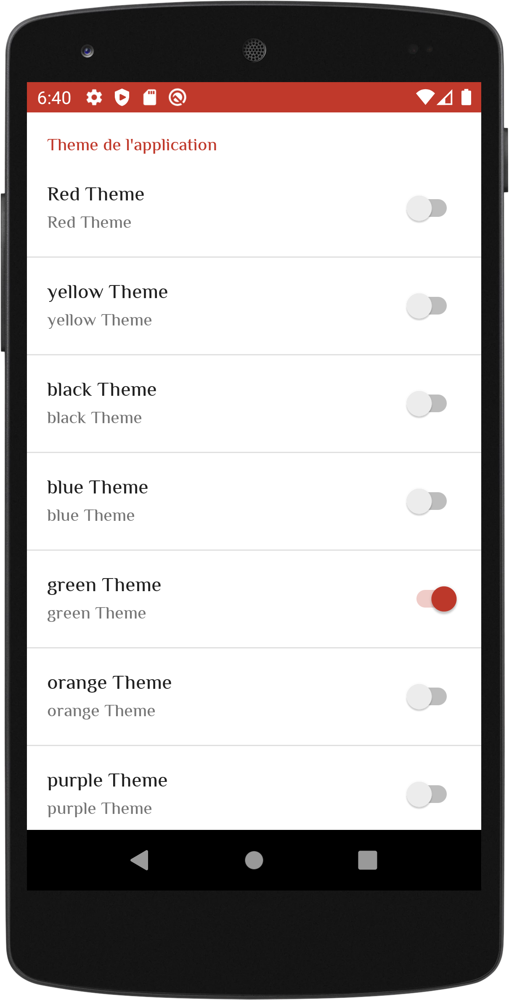
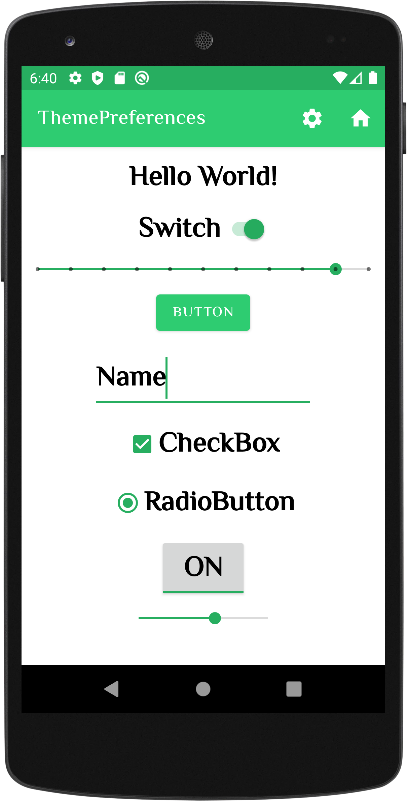
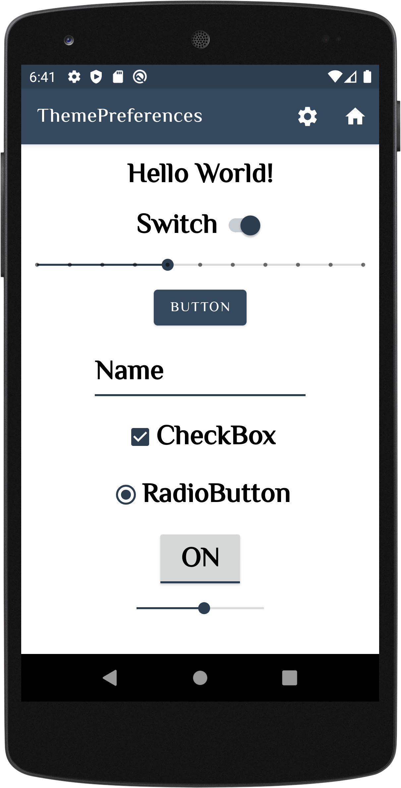
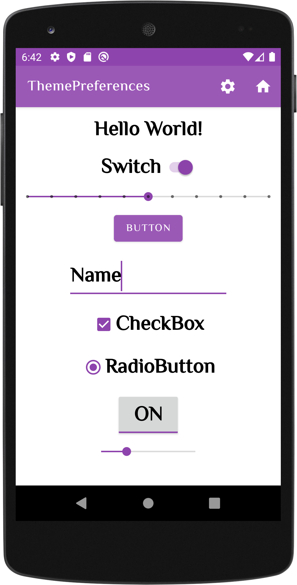
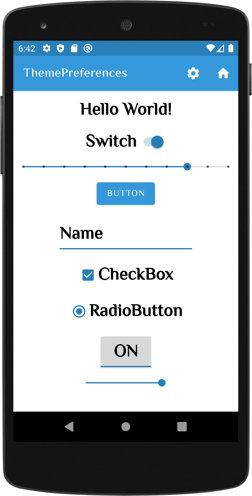

# ChangeThemeWithSharedPreferences
> An Android application to change the theme using AndroidX Preferences library

## Prerequisites

- Install Android Studio :
> From : [Android Studio](https://developer.android.com/studio)

## Screenshots
| Preference Screen | Green Theme |
| :---: | :---: |
|  |  |

| Black Theme | Purple Theme |
| :---: | :---: |
|  |  |

| Blue Theme | Yellow Theme |
| :---: | :---: |
|  |  |

## Contributing

Contributions are what make the open source community such an amazing place to be learn, inspire, and create. Any contributions you make are **greatly appreciated**.

1. Fork the Project
2. Create your Feature Branch (`git checkout -b feature/AmazingFeature`)
3. Commit your Changes (`git commit -m 'Add some AmazingFeature'`)
4. Push to the Branch (`git push origin feature/AmazingFeature`)
5. Open a Pull Request

## License
[MIT License](https://choosealicense.com/licenses/mit/)
